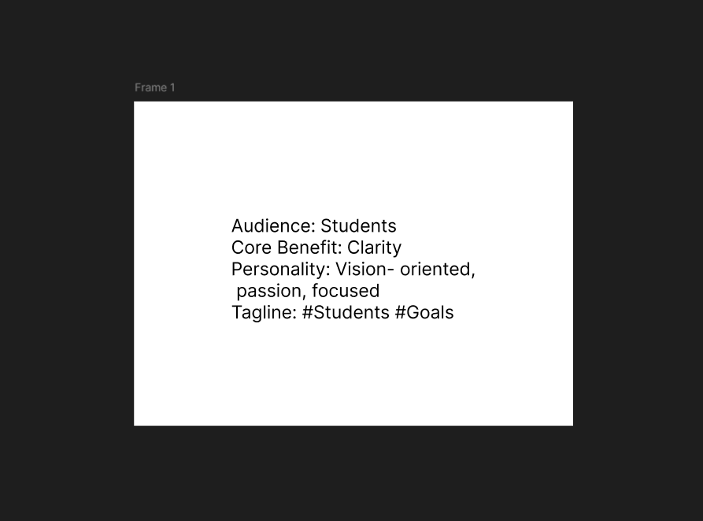

# Noor — Brand Identity Design

A complete brand identity project for **Noor**, a fictional AI productivity tool focused on clarity, focus, and simplicity.

---

## 📌 Overview

This project explores the process of building a brand from scratch — starting from strategy to final visual execution. Noor (meaning *“light”*) represents clarity in thinking and productivity, which is reflected throughout the design system.

---

## 🧠 Brand Strategy

The foundation of the project was built by defining:
- **Target Audience:** Students and busy professionals  
- **Core Benefit:** Clarity and focus  
- **Brand Personality:** Calm, sharp, human  
- **Tagline:** *“Think clearly.”*

📷 See strategy:

---

## 🎨 Design System

The visual identity is inspired by the concept of **light**:
- Minimal and geometric logo
- Dark base colors for depth
- Bright accent to represent focus and energy
- Clean, modern typography

📷 See design:

---

## 📚 Case Study

This project demonstrates:
- Logo exploration and refinement
- Color and typography decisions
- Real-world applications (business card, social media, UI)
- Mockups for presentation

📷 See full case study:

---

## 🛠 Tools Used

- Figma (UI/UX, branding, layouts)

---

## 🚀 What I Learned

- Building a brand from concept to execution  
- Creating consistent visual systems  
- Applying design across multiple formats  
- Presenting work professionally  

---

## 📎 About Me

I’m a UI/UX and Graphic Designer passionate about creating clean, user-focused designs. I enjoy turning ideas into meaningful visual experiences and continuously improving through hands-on projects.

---
